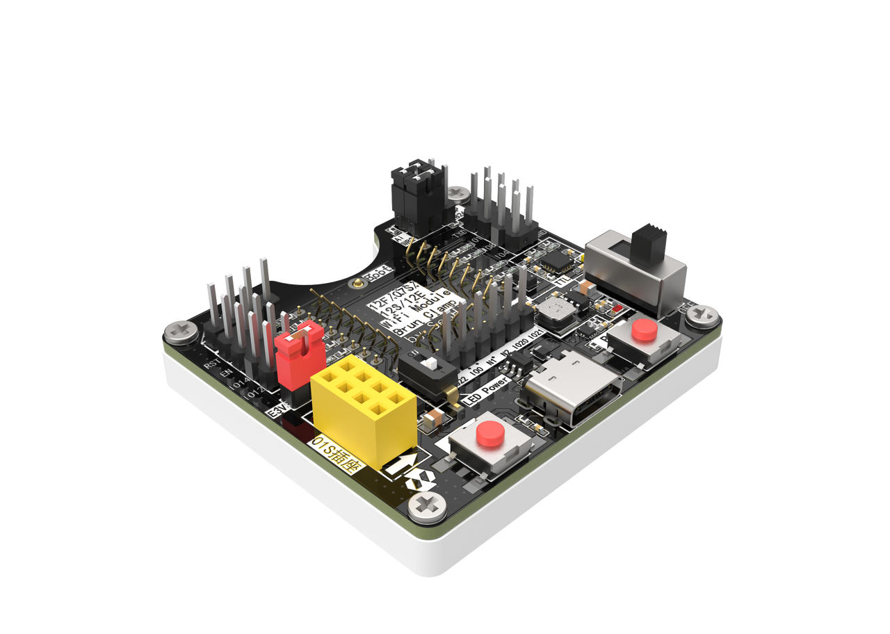

[中文教程](./README_zh.md)
# BrunTools

This is a specialized burn-in fixture designed for Wi-Fi modules that allows for firmware burning without soldering. You can install the module on the burn-in fixture and then use a serial port for firmware burning. The fixture also brings out the module's related GPIO pins to a header, in addition to each GPIO having an LED output, which you can use to test the functionality of the GPIO. Of course, if you don't want to use these LEDs, you can also use switches to turn them off.

Most importantly, it supports burning for Anxinke Ai-WB2 series, Ai-M62 series modules, and Espressif 8266 series modules. It also supports SWD debugging and burning for BW20 series.

# Usage Tutorial

For usage instructions, please refer to the [12F/01S Burn-in Fixture User Guide](https://kcni7exx72zv.feishu.cn/wiki/space/7459038259952418844?ccm_open_type=lark_wiki_spaceLink&open_tab_from=wiki_home)

# [JCL Project >>](https://oshwhub.com/seahi/bruntools)
