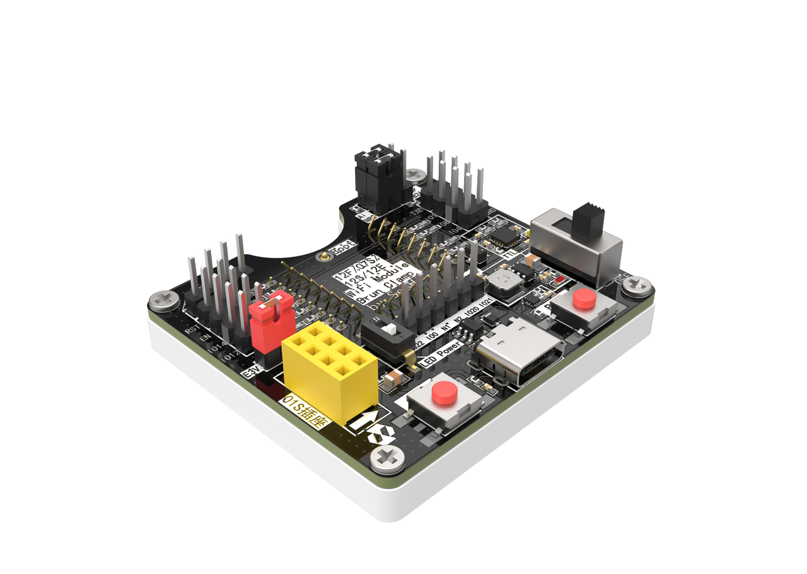

# BrunTools

这是一款专门为 WiFi 模组提供免焊接烧录的烧录架，可以把模组安装在烧录架上，然后使用串口进行固件烧录。烧录架还把模组相关的 GPIO 口引到排针，除此之外，每个 GPIO 都有引出 LED，你可以使用这些 LED 来测试 GPIO 的功能。当然，如果不想用这些 LED 的话，也可以使用开关来关闭它们。
最重要的是，它同时支持安信可 Ai-WB2 系列、Ai-M62 系列模组 和乐鑫 8266 系列模组的烧录。而且还支持BW20 系列的SWD 调试和 烧录。

# 使用教程

使用教程请参考：[12F/01S烧录架使用指南](https://kcni7exx72zv.feishu.cn/wiki/space/7459038259952418844?ccm_open_type=lark_wiki_spaceLink&open_tab_from=wiki_home)

# [JCL 开源地址 >>](https://oshwhub.com/seahi/bruntools)
